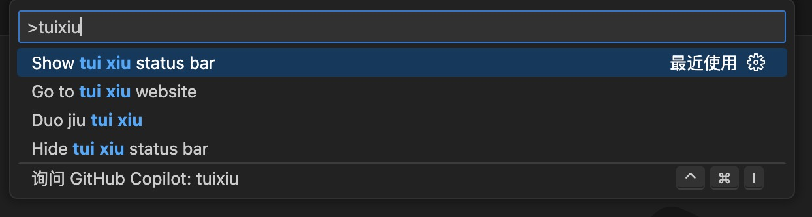

# bo-retire

博之退休倒计时

## Features

`command` + `shift` + `p`, 输入 `tuixiu`

支持以下命令

### 状态栏倒计时

开启：`Show tui xiu status bar`

关闭：`Hide tui xiu status bar`

### 一次性提示

`Duo jiu tui xiu`

### 前往博之退休官方网站

`Go to tui xiu website`

### 0.0.1

- 支持状态栏展示
- 支持一次性提示
- 支持网站跳转
